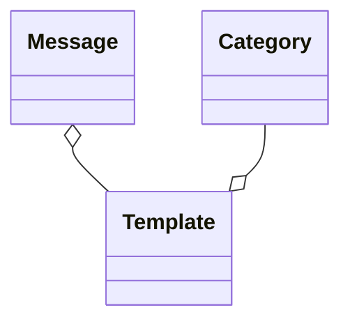

# squirrelwheel

## 1. 概要

WordPress の feed を取得して、更新情報を Twitter に投稿する。
投稿のタイミングを自動的に分散させる。
投稿のテンプレートを編集することができる。

手動の投稿も可能。その場合は、指定した日時まで投稿を待機させることが可能。

管理機能は外部の認証を利用する。

## 2. 開発環境

```bash
$ git --version
git version 2.38.1

$ php --version
PHP 8.0.26 ... ...

$ git clone git@github.com:MichinobuMaeda/squirrelwheel.git
$ cd squirrelwheel
```

## 3. デプロイ

```bash
$ git clone git@github.com:MichinobuMaeda/squirrelwheel.git
$ cd squirrelwheel
```

## 4. 仕様

### 4.1. ER



### 4.2. テーブルの定義

#### 4.2.1. Talbe: category

| Name        | Type       | Constraints      | Deafult      |
|-------------|------------|------------------|--------------|
| category_id | integer    | PK               |              |
| name        | text       | unique, not null |              |
| update_only | boolean    | not null         | false        |
| priority    | integer    | not null         | 1            |
| checked_at  | timestamp  |                  |              |
| created_at  | timestamp  |                  |              |
| updated_at  | timestamp  |                  |              |
| deleted_at  | timestamp  |                  |              |

#### 4.2.2. Talbe: template

| Name        | Type       | Constraints      | Deafult      |
|-------------|------------|------------------|--------------|
| template_id | integer    | PK               | autoincremnt |
| category_id | integer    | FK               |              |
| name        | text       | unique, not null |              |
| body        | text       | not null         |              |
| created_at  | timestamp  |                  |              |
| updated_at  | timestamp  |                  |              |
| deleted_at  | timestamp  |                  |              |

#### 4.2.3. Talbe: message

| Name        | Type       | Constraints      | Deafult      |
|-------------|------------|------------------|--------------|
| message_id  | integer    | PK               | autoincremnt |
| template_id | integer    | FK               |              |
| content     | text       | not null         |              |
| link        | text       |                  |              |
| scheduled_after | timestamp  | not null     |              |
| sent_at     | timestamp  |                  |              |
| created_at  | timestamp  |                  |              |
| updated_at  | timestamp  |                  |              |
| deleted_at  | timestamp  |                  |              |

### 4.3. データについての補足説明

#### 4.3.1. 利用するRDBMSに存在しない型の扱い

- boolean: 0: false / 1: true で integer 値を格納
- timestamp: ISO-8601 フォーマットで text 値を格納

#### 4.3.2. 初期データ

- 手動投稿用のデータ
    - ``category``
        - ``category_id = 0``
        - ``update_only = 0``
        - ``category:priority = 0``
    - ``template``
        - ``template_id = 0``
        - ``category_id = 0``

#### 4.3.3. テンプレートの仕様

- `message::content` と `message::link` の埋め込み場所は
`template::body` に `%%content%%`, `%%link%%` と記載する。
- `category_id` に対応する `template_id` が複数ある場合はランダムに選択する。

#### 4.3.4. feed の処理

- ``category:category_id > 0`` のカテゴリーを対象とする。
- 対象となるカテゴリーの Atom feed を `?cat=[category_id]&feed=atom` から取得する。
- 処理済みの Atom feed の ``/feed/updated`` を ``category:checked_at`` に格納する。
- ``category:update_only = 0`` の場合、各記事を処理対象とする。
- ``category:update_only = 1`` の場合、前回の処理以降のアップデートが有る場合に処理する。

### 4.4. ジョブ

#### 4.4.1. ジョブのトリガー

- CRONを利用して、投稿したい曜日・時刻に実行する。

#### 4.4.2. 投稿の条件

- ジョブの実行毎に1個だけ投稿する。
- `message::scheduled_after` が現在時刻より後の場合は処理対象としない。
- 優先順位
    1. ``category:priority`` 昇順
    2. ``message::scheduled_after`` 昇順
- ``category:update_only = 1`` の場合、未処理の投稿が残っている場合は投稿を追加しない。

### Appendix A このプロジェクトの初期構築手順

```bash
$ php --version
PHP 8.0.26 ... ...

$ composer --version
Composer version 2.4.4 ... ...

$ node --version
v16.14.2

$ composer create-project laravel/laravel squirrelwheel

```
