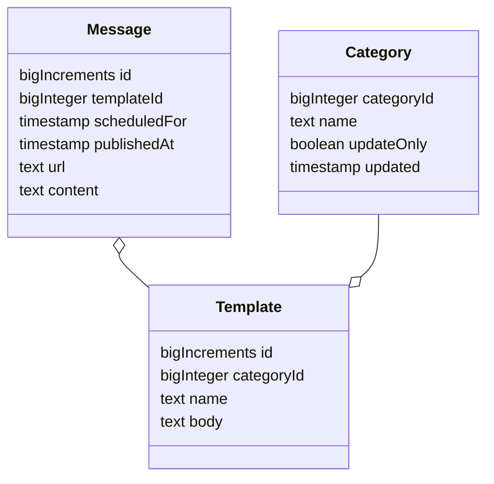

# squirrelwheel

## 1. 概要

WordPress の feed を取得して、更新情報を Twitter に投稿する。
投稿のタイミングを自動的に分散させる。
投稿のテンプレートを編集することができる。

手動の投稿も可能。その場合は、投稿日時の指定が可能。

## 2. 開発環境

```bash
$ git --version
git version 2.38.1

$ php --version
PHP 8.1.4 ... ...

$ composer --version
Composer version 2.4.4 ... ...

$ node --version
v16.18.1

$ git clone git@github.com:MichinobuMaeda/squirrelwheel.git
$ cd squirrelwheel
$ touch database/database.sqlite
$ cp .env.local .env
$ composer install
$ php artisan serve
```

## 3. 仕様



### 3.1. 定時のジョブ

- 全てのカテゴリの Atom feed を `?cat=[categoryId]&feed=atom` から取得する。
- `Category` の更新時刻: `/feed/updated` を取得する。
- 記録された `Category` の更新時刻より取得した `Category` の `updated` が後の場合、
    - `Category` が `updateOnly = true` の場合、
        - `Category` に対応する `Template` を選択する。
        - `Message` を作成する。
            - `templateId` は選択した `Template`
            - `scheduledFor` は指定無し
            - `url` は指定無し
            - `content` は指定無し
    - `Category` が `updateOnly = true` ではない場合、
        - すべての項目 `/feed/entry` について、
            - 項目の更新時刻: 　`/feed/entry/updated` を取得する。　
            - 記録された　`Category` の更新時刻より項目の更新時刻が後の場合、
                - `Category` に対応する `Template` を選択する。
                - `Message` を作成する。
                    - `templateId` は選択した `Template`
                    - `scheduledFor` は指定無し
                    - `url` は `/feed/entry/id`
                    - `content` は `/feed/entry/title`
    - `Category` の更新時刻を `updated` に保存する。
- 現在の日付の `publishedAt` の `Message` が無い場合、
    - `scheduledFor` が 現在の日時以降で `publishedAt` が未記入の　`Message` について、
        - 投稿する。
        - `publishedAt`　に現在の日時を保存する。
        - 1件処理したら以降の `Message` はスキップ。
- 現在の日付の `publishedAt` の `Message` が無い場合、
    - `publishedAt` が未記入の　`Message` について、
        - 投稿する。
        - `publishedAt`　に現在の日時を保存する。
        - 1件処理したら以降の `Message` はスキップ。

`Category` に対応するテンプレートが複数ある場合はランダムに選択する。

### 3.2. `Category` の編集

- `categoryId` 必須、一意、整数値
- `name` 必須、一意
- `updateOnly`
- `updated`

手動投稿は `categoryId = 0`

### 3.3. `Template` の編集

- `name` 必須、一意
- `categoryId` 必須、存在する `Category` から選択
- `body` 必須

`Message` の `url`, `content` の埋め込み場所は
`Template` の `body` に `%%url%%`, `%%content%%` と記載する。

### 3.4. 手動投稿の編集

- `templateId` 必須、 `categoryId = 0` の `Category`　から選択
- `content`
- `scheduledFor`
