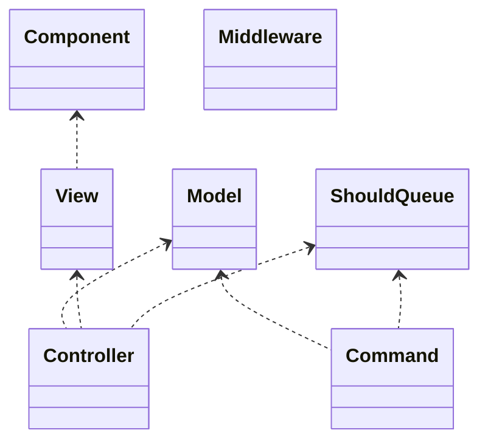
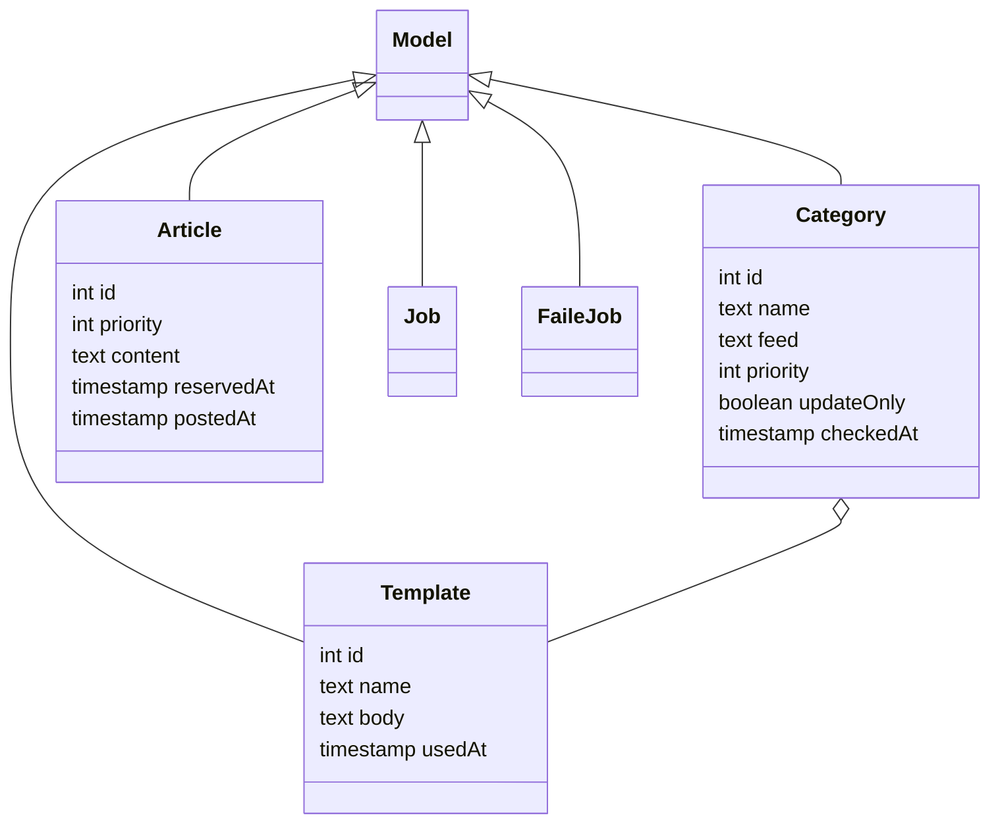
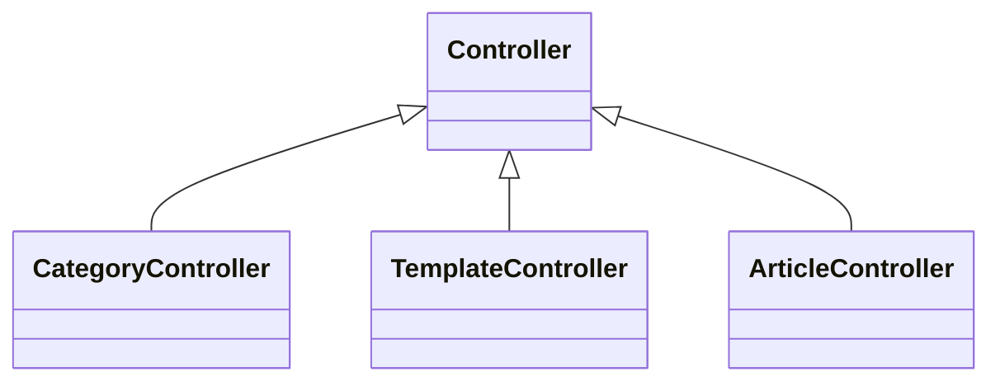
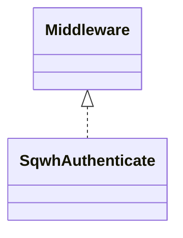
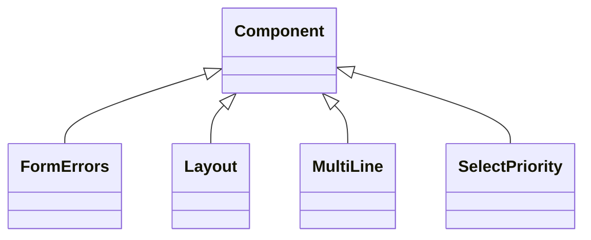
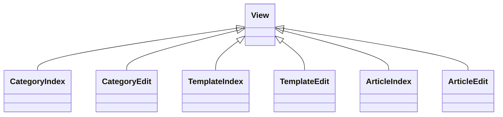
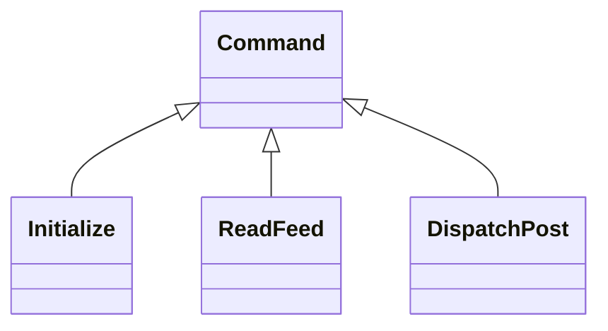
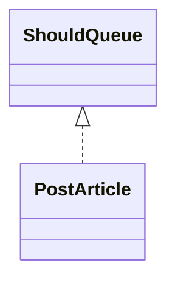

# squirrelwheel

このツールは [MIT License](LICENSE) で公開しますが、他の人が利用することは考えずに作っているので、設置は難しいと思います。なお、過剰な連投などによりサーバ設置者などの第三者に迷惑をかける利用はお断りします。

## 1. 概要

Twitter と Mastodon に半自動で投稿する。

PHP 8.0 以降で Composer が利用できる環境にインストール可。 XServer やさくらなどの共用レンタルはたぶんだいじょうぶ。

投稿のタイミングは即時と定時。定時の投稿のタイミングは所定の定時ジョブ起動時のみ。定時ジョブでは連投せず、各メディアに 1件だけ投稿し、残りは次の定時ジョブまでキューに残す。

投稿内容は、以下の2種類を利用できる。

- 手書き
- WordPress の feed
    - atom のみ対応。

定時ジョブは CRON などの外部の仕組みを利用する。共用レンタルサーバで負荷の高い処理を避けるため、 Laravel の Task Scheduling は利用しない。

管理機能の認証は、以下の 2種類を選択できる。

- DokuWiki の認証
    - 同じサーバ上でセッションを共有できる必要がある。
- Mastodon の OAuth 認証
    - アプリを開設したサーバの、指定したアカウントのみ利用可。
    - アカウントは複数指定可。

管理機能は以下のとおり。

- カテゴリー ( 手書き即時・定時、 Feed 定時など ) の追加・編集
- 各カテゴリー用のテンプレートの追加・編集
- 手書き投稿の追加と、待機中の投稿の編集

## 2. 開発環境

必要なもの

- git
- PHP >= 8.0
- Composer
- node >= 16

```bash
git clone git@github.com:MichinobuMaeda/squirrelwheel.git
cd squirrelwheel
composer install
npm install
cp .env.example .env
 cp scheduled_job.sample.sh scheduled_job.sh
php artisan key:generate

touch database/database.sqlite
php artisan migrate
php artisan test

php artisan migrate:fresh
php artisan command:initialize
npm run build
php artisan serve
```

## 3. 本番環境

サーバ上の公開されていない場所にツールの本体を置く。

```bash
git clone git@github.com:MichinobuMaeda/squirrelwheel.git
cd squirrelwheel
```

<https://getcomposer.org/download/> の手順で composer をインストールする。

```bash
php composer.phar install
cp .env.example .env
cp scheduled_job.sample.sh scheduled_job.sh
php artisan key:generate
```

`.env` を編集する。

```env
APP_ENV=production 
APP_DEBUG=false
APP_URL=https://example.com
APP_TIMEZONE=Asia/Tokyo
APP_LOCALE=ja

SQWH_AUTH_PROVIDER=doku # <-- or mstdn

SQWH_DOKU_BASE_PATH=/wiki/
SQWH_DOKU_LOGIN_URL=https://example.com/wiki/?do=login
SQWH_DOKU_GROUPS=admin,user

SQWH_TW_CONSUMER_KEY=...
SQWH_TW_CONSUMER_SECRET=...
SQWH_TW_ACCESS_TOKEN=...
SQWH_TW_ACCESS_TOKEN_SECRET=...

SQWH_MSTDN_SERVER=https://server.tld
SQWH_MSTDN_USERS=username
SQWH_MSTDN_CLIENT_KEY=...
SQWH_MSTDN_CLIENT_SECRET=...
SQWH_MSTDN_ACCESS_TOKEN=...

LOG_CHANNEL=daily
LOG_DRIVER_JOB=daily
LOG_LEVEL=info
```

```bash
touch database/database.sqlite
php artisan migrate
php artisan command:initialize
```

`scheduled_job.sh` を環境に合わせて編集する。

- `public/build` に開発環境の `npm run build` で生成したファイルを置く。
- `public/index.php` 内の3箇所の `__DIR__.'/../ ... ...` を書き換える。
- `public` フォルダを公開する場所に置く。

`scheduled_job.sh` の以下の行を必要に応じて書き換える。

```bash
#!/usr/bin/env bash

PHP_COMMAND=php
```

`scheduled_job.sh` を CRON に登録する。

例

```cron
53 11 * * * /bin/bash /home/user/squirrelwheel/scheduled_job.sh > /dev/null 2>&1 
```

### アップデート

```bash
git pull
```

`.env.example` に変更がある場合は `.env` に反映する。

```bash
php artisan cache:clear
php artisan config:clear
php artisan view:clear
php artisan migrate
```

## 4. 仕様

### 4.1. 静的構造

















### 4.2. 投稿の条件

priority: 優先度

- 0: 管理機能で作成して保存したら、即時に投稿する。
- 1 以上: 定時ジョブでキューに登録する。優先度の値が小さい方が優先。投稿するまでは文面を変更できる。

reservedAt: 待機日時

- 待機日時になるまではキューに登録しない。

## Appendix A このプロジェクトの初期構築手順

```bash
$ php --version
PHP 8.0.26 ... ...

$ composer --version
Composer version 2.4.4 ... ...

$ node --version
v16.14.2
```

```bash
composer create-project laravel/laravel squirrelwheel
cd squirrelwheel
composer remove laravel/sanctum
composer require guzzlehttp/guzzle
composer require abraham/twitteroauth
rm database/migrations/2019_12_14_000001_create_personal_access_tokens_table.php
rm config/sanctum.php
rm database/migrations/2014_10_12_000000_create_users_table.php
rm database/migrations/2014_10_12_100000_create_password_resets_table.php
rm app/Models/User.phps
php artisan queue:table
```

`.env.example` を編集する。

```bash
cp .env.example .env
php artisan key:generate
php artisan make:migration  create_categories_table
php artisan make:migration  create_templates_table
php artisan make:migration  create_articles_table
php artisan make:model Category
php artisan make:model Template
php artisan make:model Article
php artisan make:command Initialize
php artisan make:command ReadFeed
php artisan make:command DispatchPost
php artisan make:job PostArticle
php artisan make:controller CategoryController --model=Category --resource --requests
php artisan make:controller TemplateController --model=Template --resource --requests
php artisan make:controller ArticleController --model=Article --resource --requests
php artisan make:middleware SqwhAuthenticate
php artisan make:controller SqwhAuthController
php artisan session:table
```

`config/sqwh.php` を追加する。

```bash
rm resources/views/welcome.blade.php
php artisan make:component Layout
php artisan  make:test Models\CategoryTest
php artisan  make:test Models\TemplateTest
php artisan  make:test Models\ArticleTest
rm resources/js/bootstrap.js 
> resources/js/app.js 
npm uninstall axios
npm install -D tailwindcss postcss autoprefixer @tailwindcss/typography daisyui
npx tailwindcss init -p
```

`tailwind.config.js` と `app.css` を編集 <https://tailwindcss.com/docs/guides/laravel>

`layout.blade.php` の `<head>` に `@vite('resources/css/app.css')` を追加する。

`resources/images/logo.svg` と `resources/images/logo.png` を作成する。

[Favicon Generator for perfect icons on all browsers](https://realfavicongenerator.net/) に `resources/images/logo.png` を入力して作成したアイコンイメージとHTMLソースを `public` の下に反映する。

```bash
touch app/helpers.php
```

`composer.json` の `"autoload"` に `app/helpers.php` を追加する。

```json
    "autoload": {
        "files": [
            "app/helpers.php"
        ],
```

```bash
composer dump-autoload
```
