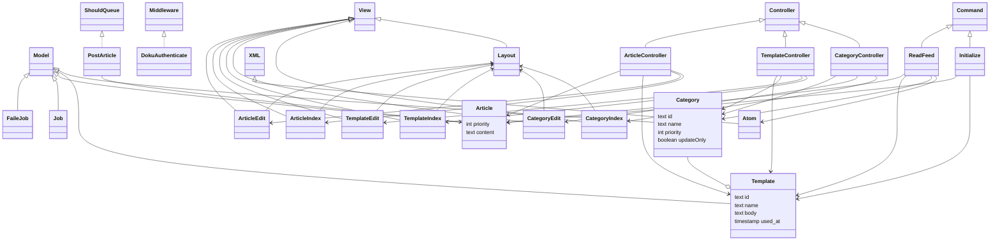

# squirrelwheel

## 1. 概要

WordPress の feed を取得して、更新情報を Twitter に投稿する。
投稿のタイミングを自動的に分散させる。
投稿のテンプレートを編集することができる。

手動の投稿も可能。その場合は、指定した日時まで投稿を待機させることが可能。

管理機能は外部の認証を利用する。

## 2. 開発環境

```bash
$ git --version
git version 2.38.1

$ php --version
PHP 8.0.26 ... ...

$ composer --version
Composer version 2.4.4 ... ...

$ node --version
v16.14.2

```

```bash
git clone git@github.com:MichinobuMaeda/squirrelwheel.git
cd squirrelwheel
composer install
npm install
cp .env.example .env
php artisan key:generate

touch database/database.sqlite
php artisan migrate
php artisan test

php artisan migrate:fresh
php artisan command:initialize
npm run build && php artisan serve
```

## 3. 本番環境

```bash
git clone git@github.com:MichinobuMaeda/squirrelwheel.git
cd squirrelwheel
cp .env.production .env
php artisan key:generate
```

`.env.example` を編集する。

```env
APP_ENV=production 
APP_DEBUG=false
LOG_CHANNEL=daily
LOG_LEVEL=info
DOKU_BASE_PATH=/wiki/
DOKU_LOGIN_URL=https://example.com/wiki/?do=login
DOKU_GROUPS=admin,user
FEED_URL=https://example.com/?cat=[category]&feed=atom
MAIL_MAILER=smtp
MAIL_HOST=
MAIL_PORT=
MAIL_USERNAME=
MAIL_PASSWORD=
MAIL_ENCRYPTION=
MAIL_FROM_ADDRESS="hello@example.com"
MAIL_FROM_NAME="${APP_NAME}"
```

```bash
touch database/database.sqlite
php artisan migrate
php artisan command:initialize
```

- `public/build` に開発環境の `npm run build` で生成したファイルを置く。
- `public/index.php` 内の3箇所の `__DIR__.'/../ ... ...` を書き換える。
- `public` フォルダを公開する場所に置く。

## 4. 仕様

### 4.1. 静的構造



### 4.2. データについての補足説明

#### 4.2.1. テンプレートの仕様

- `article::content` と `article::link` の埋め込み場所は `template::body` に `%%content%%`, `%%link%%` と記載する。
- `category_id` に対応する `template_id` が複数ある場合は利用歴の古いものを選択する。

#### 4.2.2. feed の処理

- `category:id not like '@%'` のカテゴリーを対象とする。
- 対象となるカテゴリーの Atom feed を `FEED_URL` から取得する。
- 処理済みの Atom feed の `/feed/updated` を `category:checked_at` に格納する。
- `category:update_only == false` の場合、各記事を処理対象とする。
- `category:update_only == true` の場合、前回の処理以降のアップデートが有る場合に処理する。

### 4.3. ジョブ

#### 4.3.1. ジョブのトリガー

- CRONを利用して、投稿したい曜日・時刻に実行する。

#### 4.3.2. 投稿の条件

- ジョブの実行毎に1個だけ投稿する。
- `message::reserved_at` が現在時刻より後の場合は処理対象としない。
- 優先順位
    1. `message:priority` 昇順
    2. `message::reserved_at` 昇順
    3. `message::id` 昇順
- `category:update_only = 1` の場合、未処理の投稿が残っている場合は投稿を追加しない。

### Appendix A このプロジェクトの初期構築手順

```bash
$ php --version
PHP 8.0.26 ... ...

$ composer --version
Composer version 2.4.4 ... ...

$ node --version
v16.14.2
```

```bash
composer create-project laravel/laravel squirrelwheel
composer remove laravel/sanctum
rm database/migrations/2019_12_14_000001_create_personal_access_tokens_table.php
rm config/sanctum.php
rm database/migrations/2014_10_12_000000_create_users_table.php
rm database/migrations/2014_10_12_100000_create_password_resets_table.php
rm app/Models/User.phps
php artisan queue:table
```

`.env.example` を編集する。

```bash
cp .env.example .env
php artisan key:generate
php artisan make:migration  create_categories_table
php artisan make:migration  create_templates_table
php artisan make:migration  create_articles_table
php artisan make:model Category
php artisan make:model Template
php artisan make:model Article
php artisan make:command Initialize
php artisan make:command ReadFeed
php artisan make:job PostArticle
php artisan make:controller CategoryController --model=Category --resource --requests
php artisan make:controller TemplateController --model=Template --resource --requests
php artisan make:controller ArticleController --model=Article --resource --requests
php artisan make:middleware DokuAuthenticate
```

`config/doku.php` を追加する。

```bash
rm resources/views/welcome.blade.php
php artisan make:component layout
php artisan  make:test Models\CategoryTest
php artisan  make:test Models\TemplateTest
php artisan  make:test Models\ArticleTest
rm resources/js/bootstrap.js 
> resources/js/app.js 
npm uninstall axios
npm install -D tailwindcss postcss autoprefixer @tailwindcss/typography daisyui
npx tailwindcss init -p
```

`tailwind.config.js` と `app.css` を編集 <https://tailwindcss.com/docs/guides/laravel>

`layout.blade.php` の `<head>` に `@vite('resources/css/app.css')` を追加する。

`resources/images/logo.svg` と `resources/images/logo.png` を作成する。

[Favicon Generator for perfect icons on all browsers](https://realfavicongenerator.net/) に `resources/images/logo.png` を入力して作成したアイコンイメージとHTMLソースを `public` の下に反映する。
